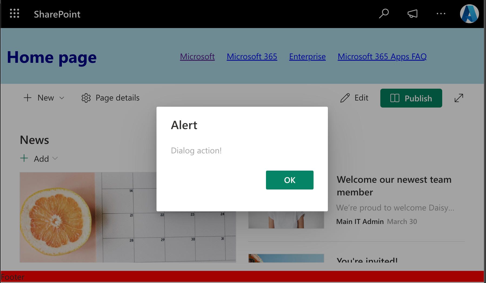

# App Customizer

## Summary

An AppCustomizer is a SharePoint Framework extension that can be used to customize the look and feel of a SharePoint page. We use it to add HTML to the Header and Footer placeholders of a SharePoint page and to render a Dialog Box when the page is loaded.
