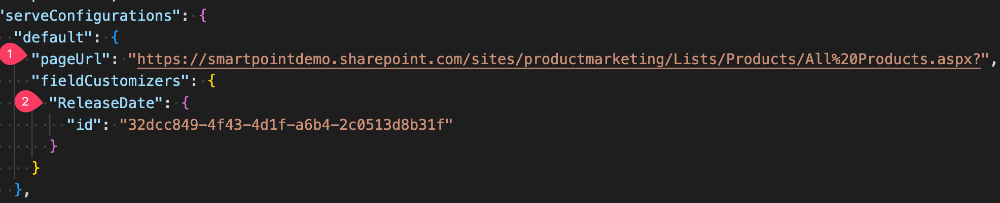
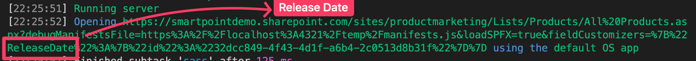

# DateCustomizer

## Summary

This code is an implementation of a SharePoint Framework (SPFx) Field Customizer, specifically for customizing the display of date fields. The `DateCustomizerFieldCustomizer` class extends `BaseFieldCustomizer<IDateCustomizerFieldCustomizerProperties>`, which provides the base functionality for field customizers in SPFx.

The DateCustomizerFieldCustomizer class has three methods that are defined:

1. `onInit()`: This method is called when the app initializes. It returns a Promise that resolves when initialization is complete.

2. `onRenderCell(event: IFieldCustomizerCellEventParameters)`: This method is called when a field that has been customized is rendered in a list view. The method receives an [IFieldCustomizerCellEventParameters](https://learn.microsoft.com/en-us/javascript/api/sp-listview-extensibility/ifieldcustomizercelleventparameters?view=sp-typescript-latest) object as its parameter. The method creates a React element using React.createElement and passes in the necessary properties. It then renders the dateCustomizer element using ReactDOM.render.
   The `IFieldCustomizerCellEventParameters` object has few important properties: - a `fieldValue` property that contains the value of the field that is being customized. - a `domElement` property that contains the DOM element that the customized field is being rendered in. - a `listItem` property that contains the list item that the field is being rendered for. - The `listItem` property has a `getValueByName` method that can be used to retrieve the value of any field in the list item. This is useful if you want to customize the display of a field based on the value of another field in the same list item.

3. `onDisposeCell(event: IFieldCustomizerCellEventParameters)`: This method is called when the customized field is disposed of or removed from the list view. It unmounts the React component from the DOM using ReactDOM.unmountComponentAtNode and calls super.onDisposeCell to clean up any additional resources.

## Functionality

This code customizes the display of date fields in a SharePoint list view by rendering a React component called `DateCustomizer`. The `DateCustomizer` component takes in two props: `text` and `productTitle`.

The `text` prop is the value of the date field that is being customized. The `productTitle` prop is the value of the "Title" field for the current list item. The `productTitle` prop is used as a label to describe the date field being customized.

## serve.json

To debug this extension, you need to configure the [serve.json](./config/serve.json) file. This file is used to configure the local web server that hosts the workbench for debugging.  

Here you need to change:

1. `pageUrl` to the URL of the page where you want to test the extension. This is the URL of the page that contains the list view that you want to customize.
2. `fieldCustomizers.{fieldInternalName}` to the internal name of the date field that you want to customize.

**Important!**
Sometimes the internal name of the date field is not the same as the display name of the date field. While debugging your web part, you will need to use the display name in the URL query string. For example, our field has 'ReleaseDate' internal field name, but 'Release Date' (with a space) as a display name. So, we will change it like that:

