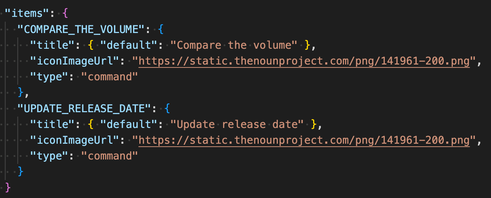
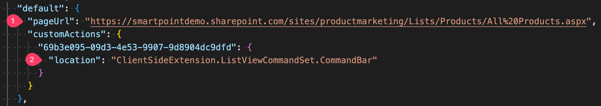
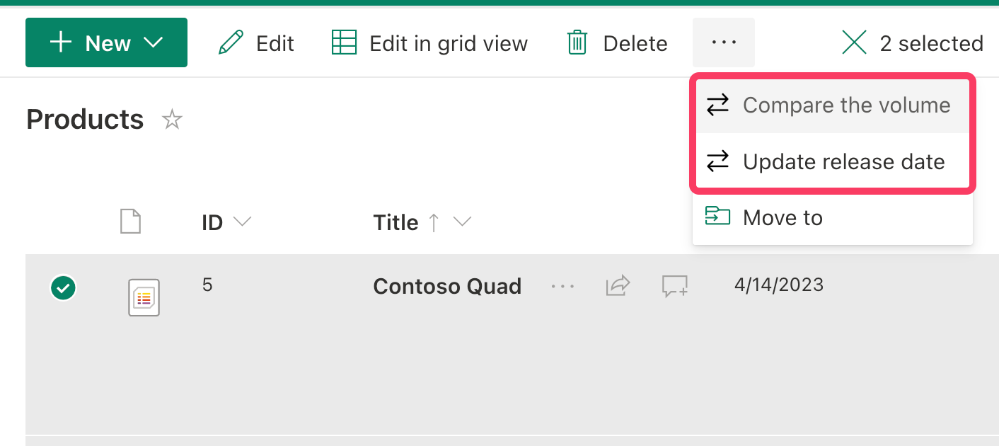
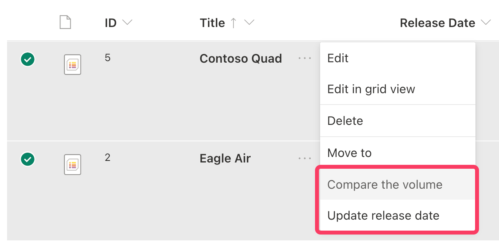

# Products Commands - SPFx CommandSet Extension

## Summary

This code is a command set that extends the BaseListViewCommandSet of SharePoint. It adds custom commands to the list view of a "Products" list.

## Features

- Adds two custom commands:
  - "COMPARE_THE_VOLUME": compares the CustomerRating column of two products and displays a message box with the results.
  - "UPDATE_RELEASE_DATE": updates the ReleaseDate column of the selected product and refreshes the page.
- Sets the visibility of the "COMPARE_THE_VOLUME" command based on the current selection of items (shows the command if two items are selected).

## Creation steps

1. Create a new SharePoint Framework project using the "List View Command Set" template.
2. Update ProductCommandsCommandSet.manifest.json file to include the items - our commands.
   - We add two commands: "COMPARE_THE_VOLUME" and "UPDATE_RELEASE_DATE".
   - We set their titles and icons. Icons can lead to a local file or a URL.
   - `type` is always set to `command`.
     
3. Update ProductCommandsCommandSet.ts file to implement the commands. The commands functionality is described using comments.
   - We add two methods: `compareTheVolume` and `updateReleaseDate`.
   - We set the visibility of the "COMPARE_THE_VOLUME" command based on the current selection of items (shows the command if two items are selected).

## serve.json

To debug this extension, you need to configure the [serve.json](./config/serve.json) file. This file is used to configure the local web server that hosts the workbench for debugging.  

Here you need to change:

1. `pageUrl` to the URL of the page where you want to test the extension. This is the URL of the page that contains the list view that you want to customize.
2. `location` to the place where you want to see the extension's commands. There is 2 options:
   - `ClientSideExtension.ListViewCommandSet.CommandBar` - to add the commands to the upper ribbon command bar.
     
   - `ClientSideExtension.ListViewCommandSet.ContextMenu` - to add the commands to the element's context menu.
     
