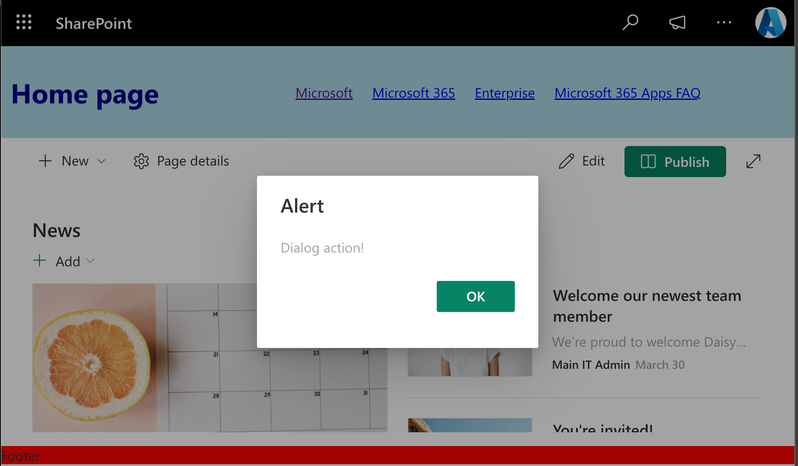

# SPFx Extensions

## 1. AppCustomizer - Application Customizer

[App Customizer README](./AppCustomizer/README.md)

## 2. FieldCustomizer (HTML)

[Field Customizer README](./FieldCustomizer/README.md)  

## 3. DateCustomizer - Field Customizer (React)

[Date Customizer README](./DateCustomizer/README.md) - With additional instructions  

## 4. ProductsCommands - Command Set

[Products Commands README](./ProductsCommands/README.md) - With additional instructions  

